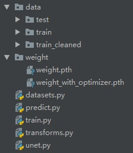
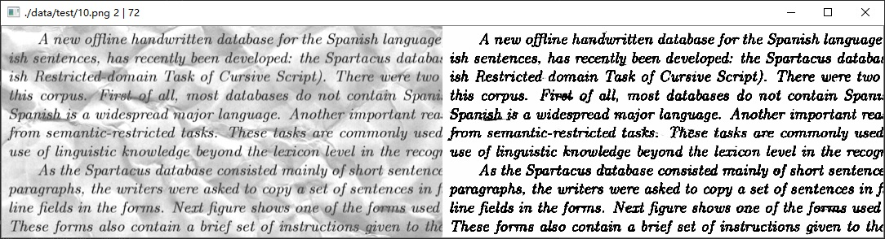
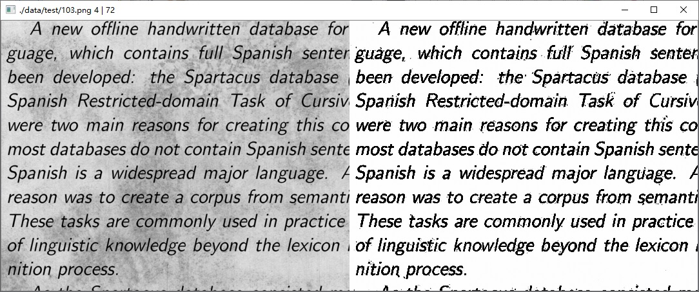
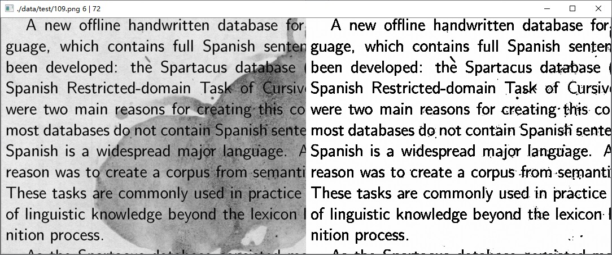
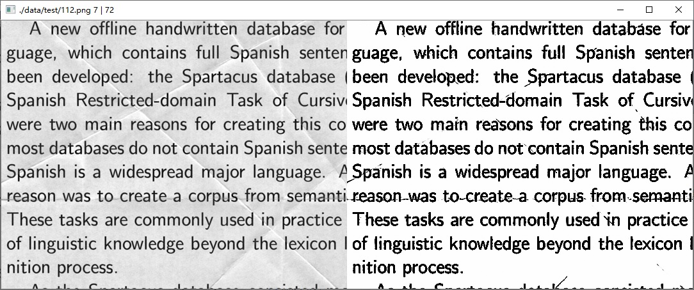

# unet-denoising-dirty-documents
unet 实现文本文档去噪、去水印

# requirement
torch 1.2.0<br>
torchvision 0.4.0<br>
opencv-python 4.1.0.25<br>
numpy 1.16.2<br>

# usage
## 1. dataset
下载链接：[denoising-dirty-documents数据集](https://pan.baidu.com/s/1_ge63IVuuVqifbi_iXPoJg)<br>提取码：d8l7<br>

## 2. train
```python train.py```<br>
数据增强在 transforms.py 包括灰度化、水平垂直翻转、旋转、裁剪、直方图均衡化、均值滤波、Log灰度变换
## 3. predict
```python predict.py```<br>
## 4. pretrained model
下载链接：[预训练模型1.5M](https://pan.baidu.com/s/1L3v-xehLBk-G6kbb55vGnA)<br>
提取码：poyf<br>

# test images





# reference
[眼底图像血管分割 retina-unet](https://github.com/orobix/retina-unet)
